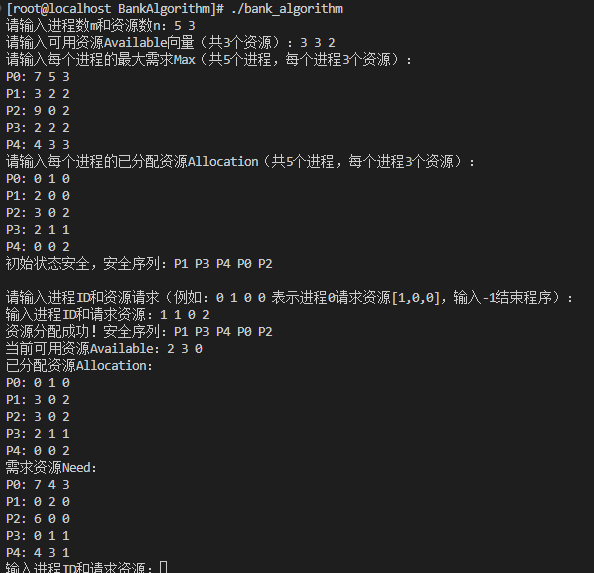

银行家算法通过以下步骤避免死锁：

1. **数据结构定义**：跟踪系统的**可用资源（Available）**、进程的**最大需求（Max）**、**已分配资源（Allocation）\**和\**需求资源（Need = Max - Allocation）**。
2. **安全性检查**：模拟资源分配后，判断是否存在一个 “安全序列”—— 所有进程能依次完成（即进程的`Need`≤当前可用资源，执行后释放其`Allocation`，使可用资源增加）。
3. **资源请求处理**：进程请求资源时，先预分配并检查安全性；若安全则正式分配，否则回滚并拒绝请求。

==init.h== 初始化系统状态（输入Max、Allocation、Available）

==safe.h== 检查系统是否安全（返回安全序列）

==requestResource.h== 处理进程资源请求（输入进程ID和请求资源）

```bash
#编译：
#在终端中执行以下命令：
make
```
参考测试用例视频地址：https://www.bilibili.com/video/BV17k4y1X7dF/?spm_id_from=333.337.search-card.all.click&vd_source=0386557803f6b560842c4bbee088510f

实验结果



